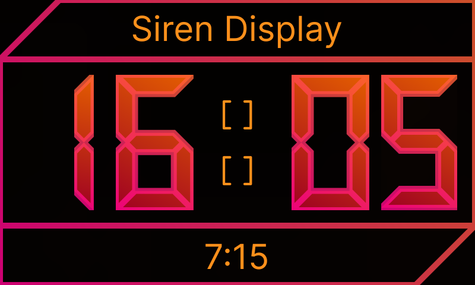
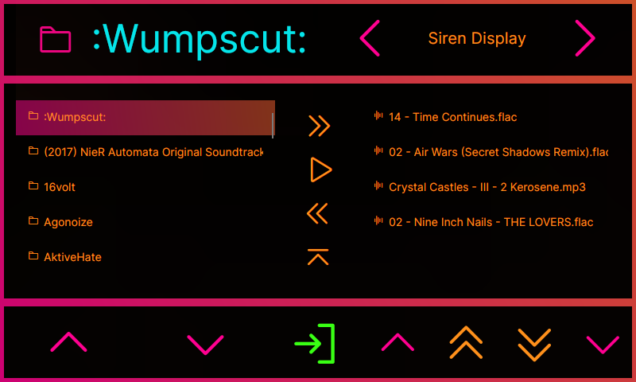
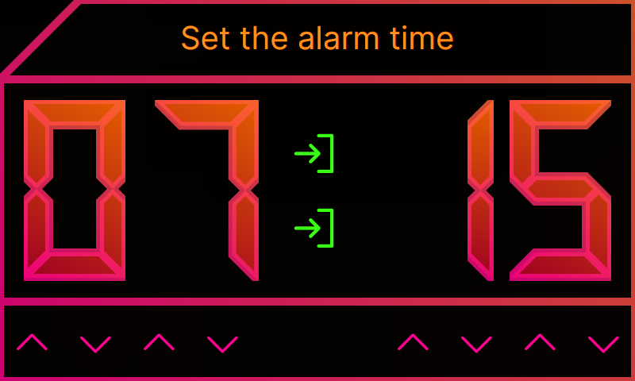

# SirenDisplay
### Stylish alarm clock for my raspberry pi. Play a song or a selected playlist as your new alarm sound.
> #### Clock View
>

> #### Playlist view
>

> #### Alarm View
>

> #### v1.1.0 Update: SpanningTreeBackground
> https://github.com/user-attachments/assets/5e3731ab-1cda-46f8-a7ec-af62b0984e4b 
>
> demonstration video

---

## Version 1.1.0 update
### SpanningTreeBackground
#### This was the name of this feature. It's purpose is to give an engine for making a highly customizable background animation
### SpanningTreeRender
#### This is the handler for the dedicated controllers. This is the component you'd wanna put into the UI. It's purpose is to call render and it's math engine Stc and ui representation Stt handles the task.
### SpanningTreeController
#### This handles the math. The math is derived from the relation between a DotMap and a TorrentLayer which is defined by the ThemeBinder. Common math functions are collected within AnimatrixController
### SpanningTreeTheme
#### This handles the visual representation of the data prepared by Stc each cycle. The colors are to be cached in StyleArchive which will be used by an ISTTheme. The ui render and representation ie. coloring and drawing onto the canvas is defined within the ISTTheme itself. Each cycle ISTTheme checks for the ThemeGroup and renders based on that defined visual representation. Therefore making the ui styles modular yet specifically defined.
